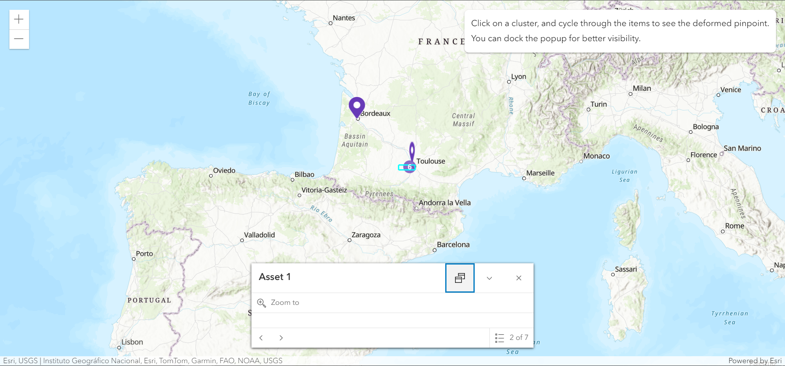

# DeformedPinpoint

This project was generated with [Angular CLI](https://github.com/angular/angular-cli) version 17.3.0.

It concerns **Esri Case #03588002**.  

> When several pinpoints are contained in a cluster, and the user navigates between them by the popup, the pinpoints are deformed.

## Development server

Run `ng serve` for a dev server. Navigate to `http://localhost:4200/`. The application will automatically reload if you change any of the source files.
